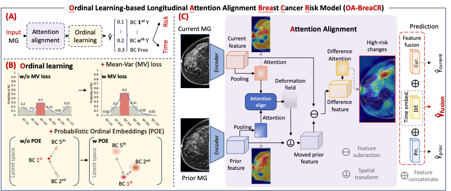

# Ordinal Learning: Longitudinal Attention Alignment Model for Predicting Time to Future Breast Cancer Events from Mammograms
This is the code of [Our MICCAI 2024 Paper](https://link.springer.com/chapter/10.1007/978-3-031-72378-0_15)

### Abstract:
Precision breast cancer (BC) risk assessment is crucial for developing individualized screening and prevention.
Despite the promising potential of recent mammogram (MG) based deep learning models in predicting BC risk,
they mostly overlook the “time-to-future-event” ordering among patients and exhibit limited explorations
into how they track history changes in breast tissue, thereby limiting their clinical application.
In this work, we propose a novel method, named **OA-BreaCR**, to precisely model the ordinal relationship of
the time to and between BC events while incorporating longitudinal breast tissue changes
in a more explainable manner. We validate our method on public EMBED and inhouse datasets,
comparing with existing BC risk prediction and time prediction methods.
Our ordinal learning method OA-BreaCR outperforms existing methods in both BC risk and
time-to-future-event prediction tasks. Additionally, ordinal heatmap visualizations
show the model’s attention over time. Our findings underscore the importance of
interpretable and precise risk assessment for enhancing BC screening and prevention efforts.



### Training
We also provide our training pipeline.
For training the OA-BreaCR model, you can run the `./train.py` after preparing your dataset: e.g.,
```bash

arch=resnet18
bs=64
# DATA
data=/Path/TO/YOUR/DATA/CSV.csv
image=/Path/TO/YOUR/IMAGES

# Results directory
result_dir=./Path/TO/YOUR/RESULT/FOLDER/

for method in OA-BreaCR
do
  echo "starting training"
  python train.py \
  --arch $arch \
  --model-method $method \
  --csv-dir $data \
  --image-dir $image \
  --results-dir $result_dir \
  --num-workers 16 \
  --batch-size $bs \
  --img-size 1024 512 \
  --max_followup 5 \
  --max_age 5 \
  --num-output-neurons 6 \
  --lr_decay_patient 3 \
  --early_stop_patient 6 \
  --training_step 50000 \
  --val_step 50000 \
  --test_step 50000 \
  --lr 5e-5 \
done
```

### Citation
If you use this code or models in your scientific work, please cite the following paper:
```bibtex
@inproceedings{wang2024ordinal,
  title={Ordinal Learning: Longitudinal Attention Alignment Model for Predicting Time to Future Breast Cancer Events from Mammograms},
  author={Wang, Xin and Tan, Tao and Gao, Yuan and Marcus, Eric and Han, Luyi and Portaluri, Antonio and Zhang, Tianyu and Lu, Chunyao and Liang, Xinglong and Beets-Tan, Regina and others},
  booktitle={International Conference on Medical Image Computing and Computer-Assisted Intervention},
  pages={155--165},
  year={2024},
  organization={Springer}
}
```

### Aknowledgement:
The whole framework is based on the
[BreaCR](https://github.com/xinwangxinwang/BreaCR),
[POEs](https://github.com/Li-Wanhua/POEs),
[Mean-Variance Loss](https://openaccess.thecvf.com/content_cvpr_2018/html/Pan_Mean-Variance_Loss_for_CVPR_2018_paper.html),
and [voxelmorph](https://github.com/voxelmorph/voxelmorph).

### Contact details
If you have any questions please contact us.

Email: ritse.mann@radboudumc.nl (Ritse Mann); taotanjs@gmail.com (Tao Tan); x.wang@nki.nl (Xin Wang)
